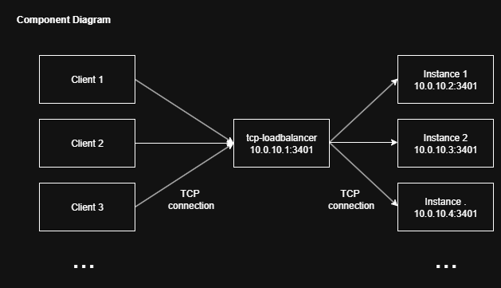

- [SW.TCPLoadBalancer](#swtcploadbalancer)
- [Overview](#overview)
- [Running](#running)
  - [Container](#container)
  - [Local](#local)
- [Logging](#logging)
- [Building](#building)

# SW.TCPLoadBalancer

# Overview

This service provides a layer 4 TCP load balancer with health checking and automatic failover if a backend service instance goes offline.
Load balancing is connection based using a time-based algorithm.

Process:
- Load balancer connects to configured backend services with watchdog connections
- Load balancer listens on configured interface and port
- Client connects to load balancer
- Load balancer uses connection details from an active watchdog connection to make a new connection to a backend service for the client
- Load balancer proxies data bi-directionally between client and backend service until either side closes the connection



# Running

## Local

Run `SW.TCPLoadBalancer.Server.exe

# Logging

All daemons log to: `./logs/*.log`
Logs are rotated when they reach 10MB, up to a maximum of 10 files.
Under containerisation, all logs go to stdout.

# Building

## Local
.NET 8 is required
```
dotnet build
```

## Container

TODO
Builds will work on Linux or Windows (via cross-compilation) and will generate a single container
artifact which is self-contained, and can be deployed anywhere.

- Install Docker Desktop or Rancher Desktop (preferred)
- From the repo root:

```
docker build --no-cache -t sw-tcploadbalancer:latest .
docker run -d -p 3401:3401 --name sw-tcploadbalancer sw-tcploadbalancer:latest
```
